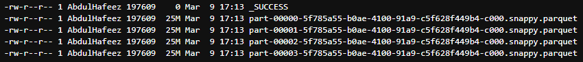

# Module 5 Homework

In this homework we'll put what we learned about Spark in practice.

For this homework we will be using the Yellow 2024-10 data from the official website: 

```bash
wget https://d37ci6vzurychx.cloudfront.net/trip-data/yellow_tripdata_2024-10.parquet
```


## Question 1: Install Spark and PySpark

- Install Spark
- Run PySpark
- Create a local spark session
- Execute spark.version.

What's the output?
### Answer
```bash
'3.3.2'
```

> [!NOTE]
> To install PySpark follow this [guide](https://github.com/DataTalksClub/data-engineering-zoomcamp/blob/main/05-batch/setup/pyspark.md)


## Question 2: Yellow October 2024

Read the October 2024 Yellow into a Spark Dataframe.

Repartition the Dataframe to 4 partitions and save it to parquet.

What is the average size of the Parquet (ending with .parquet extension) Files that were created (in MB)? Select the answer which most closely matches.

- [ ] 6MB
- [X] 25MB
- [ ] 75MB
- [ ] 100MB

### Solution



## Question 3: Count records 

How many taxi trips were there on the 15th of October?

Consider only trips that started on the 15th of October.

- [ ] 85,567
- [ ] 105,567
- [X] 125,567
- [ ] 145,567

### Solution
```python
query = """
        SELECT COUNT(*) AS num_trips
        FROM yellow_taxi_trips
        WHERE CAST(tpep_pickup_datetime AS DATE) = '2024-10-15'
        """

yellow_df = spark.sql(query)
yellow_df.show()
```

## Question 4: Longest trip

What is the length of the longest trip in the dataset in hours?

- [ ] 122
- [ ] 142
- [x] 162
- [ ] 182

### Solution
```python
query = """
    SELECT
        tpep_pickup_datetime AS pickup_datetime,
        tpep_dropoff_datetime AS dropoff_datetime,
        (UNIX_TIMESTAMP(tpep_dropoff_datetime) - UNIX_TIMESTAMP(tpep_pickup_datetime)) / 3600 AS trip_duration_hours
    FROM yellow_taxi_trips
    ORDER BY trip_duration_hours DESC
    """

yellow_df = spark.sql(query)
yellow_df.show()
```

## Question 5: User Interface

Spark’s User Interface which shows the application's dashboard runs on which local port?

- [ ] 80
- [ ] 443
- [X] 4040
- [ ] 8080


## Question 6: Least frequent pickup location zone

Load the zone lookup data into a temp view in Spark:

```bash
wget https://d37ci6vzurychx.cloudfront.net/misc/taxi_zone_lookup.csv
```

Using the zone lookup data and the Yellow October 2024 data, what is the name of the LEAST frequent pickup location Zone?

- [X] Governor's Island/Ellis Island/Liberty Island
- [ ] Arden Heights
- [ ] Rikers Island
- [ ] Jamaica Bay

### Solution
```python
query = """
        SELECT
            COUNT(*) AS cnt,
            y.PULocationID,
            z.Borough,
            z.Zone
        FROM yellow_taxi_trips AS y
        INNER JOIN taxi_zone_lookup AS z
            ON y.PULocationID = z.LocationID
        GROUP BY
            y.PULocationID,
            z.Borough,
            z.Zone
        ORDER BY
            cnt
        """
least_frequent_pickup_location_Zone = spark.sql(query)
least_frequent_pickup_location_Zone.show()
```


## Submitting the solutions

- Form for submitting: https://courses.datatalks.club/de-zoomcamp-2025/homework/hw5
- Deadline: See the website
